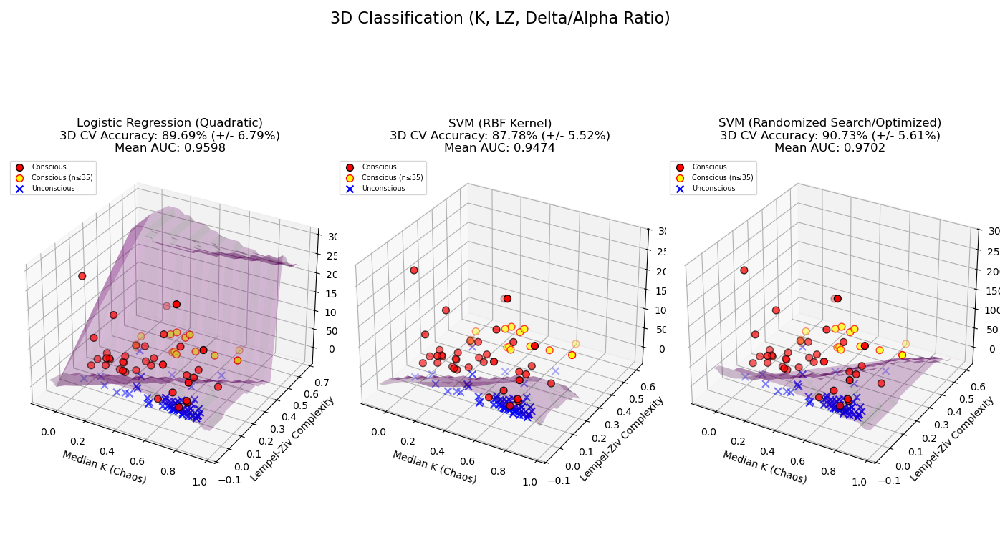

### Sources
Abel, J., Badgeley, M., Meschede-Krasa, B., Schamberg, G., Garwood, I., Lecamwasam, K., Chakravarty, S., Zhou, D., Keating, M., Purdon, P., & Brown, E. (2021). Multitaper spectra recorded during GABAergic anesthetic unconsciousness (version 1.0.0). PhysioNet. RRID:SCR_007345. [[https://doi.org/10.13026/m792-h077]]
Detti, P. (2020). Siena Scalp EEG Database (version 1.0.0). PhysioNet. RRID:SCR_007345. [[https://doi.org/10.13026/5d4a-j060]]

